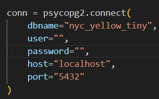
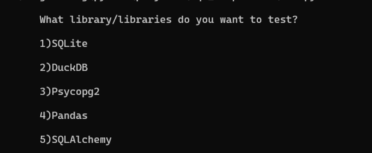
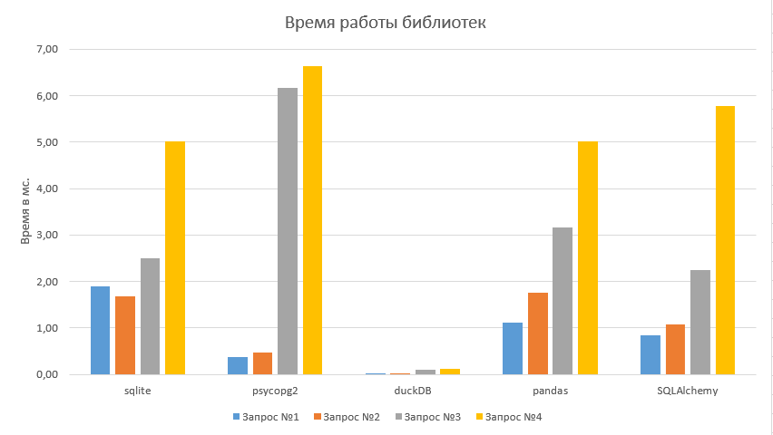

<h1 align="center">Python SQL Libraries Benchmark</h1>

Данная лабораторная работа направлена на разработку бенчмарков для измерения скорости выполнения четырех 
различных SQL-запросов, используя пять библиотек для работы с базами данных на Python. Для обеспечения достоверности 
результатов предполагается провести более 10 запусков для каждого запроса, с последующим использованием
медианного значения в качестве результата. Этот подход позволит учесть возможные колебания в 
производительности и обеспечит более точную оценку скорости выполнения запросов.

<h4>Используемы запросы в работе:</h4>
 
<b>1) SELECT VendorID, count(*) FROM yellow_taxi GROUP BY 1</b>

 
2) <b>SELECT passenger_count, avg(total_amount) FROM yellow_taxi GROUP BY 1</b>

 
3) <b>SELECT passenger_count, extract(year from tpep_pickup_datetime::timestamp) AS pickup_year ,COUNT(*)
FROM yellow_taxi GROUP BY passenger_count, pickup_year</b>

 
4) <b>SELECT passenger_count,extract(year from tpep_pickup_datetime::timestamp) AS pickup_year, round(trip_distance),
count(*) FROM yellow_taxi GROUP BY 1, 2, 3 ORDER BY 2, 4</b>

<h3 align="center">Что необходимо сделать, чтобы запустить проект?</h3>

1) Склонируйте репозиторий с данным проектом

2) Загрузите с диска датасеты необходимые для работы проекта и поместите их в папку "datasets"(https://disk.yandex.ru/d/WSAK3ucfZpTaKA)

3) Чтобы работал бенчмарк для библиотеки psycopg2, необходимо загрузить датасет в postgresql и указать 
обязательные данные для подключения к БД в файле "src/benchmark_psycopg2.py".

4) Теперь можно приступить к запуску проекта, для этого запустите файл <b>start.bat</b> и введите 
без пробелов номера тех библиотек, которые хотите протестировать. (Например: 12 или 1)

<h3 align="center">Отчёт о работе 5 библиотек</h3>
<h4>Характеристики участвовавшего компьютера в тесте:</h4>

Процессор: AMD Ryzen 3 3250U 2.60 GHz with Radeon Graphics

ОЗУ: 8,00 ГБ

Память: SSD 256 ГБ

Оперативная система: Windows 11 Pro

<h4 align="center">Диаграмма результата работы бенчмарков на 4 запросах</h4>

<b>Размер датасета в тесте:</b> ~200 МБ

Из графика можно выделить, что библиотека psycopg2 демонстрирует наивысшую продолжительность 
выполнения на четвертом запросе. Тем не менее, она опережает большинство других библиотек в обработке
первых двух запросов, за исключением duckDB. В свою очередь, библиотеки pandas и SQLAlchemy демонстрируют
схожую производительность с небольшим различием во времени выполнения каждого запроса.

Библиотека sqlite заметно отстает на первых двух запросах, но её производительность на последних 
двух запросах оказывается средней по сравнению с другими библиотеками, за исключением duckDB, который 
продолжает оставаться лидером по скорости выполнения.

Почему же duckDB работает быстрее всех? Для DuckDB нет необходимости устанавливать, обновлять 
и поддерживать программное обеспечение сервера СУБД. DuckDB не работает как отдельный процесс, 
а полностью встроен в процесс хоста. Для аналитических сценариев использования, которые DuckDB 
нацелена обслуживать, это дополнительно обеспечивает высокоскоростной передачи данных к базе 
данных и из нее.
В некоторых случаях DuckDB может обрабатывать внешние данные без их копирования.

